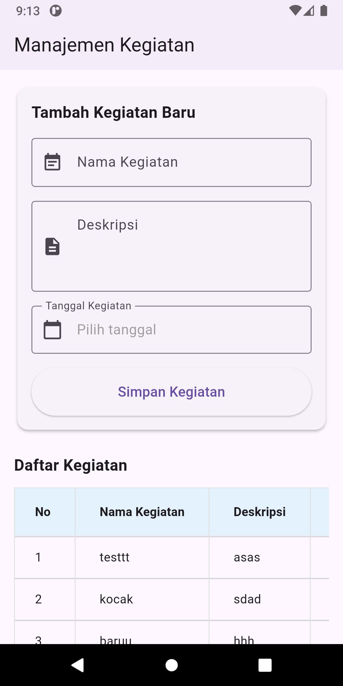

# 🚀 Cara Menjalankan Project

Backend CodeIgniter + Frontend Flutter (menggunakan ngrok)

Project ini menggunakan ngrok untuk expose backend CI agar bisa diakses oleh aplikasi Flutter.

---

## 1️⃣ Jalankan ngrok

Pastikan port backend adalah **8080**, lalu jalankan perintah berikut:

```bash
ngrok http 8080
```

Setelah berhasil, akan muncul **Forwarding URL**, contoh:

```
https://macrocytic-izayah-unpummeled.ngrok-free.dev
```

📌 **Salin URL ini**, karena akan digunakan di backend dan frontend.

---

## 2️⃣ Konfigurasi Backend (CodeIgniter)

### 📂 Lokasi
```
ci_backend/
```

### 📝 Edit File `ci_backend\.env`

Buka file berikut:

```
ci_backend/.env
```

Ubah nilai `app.baseURL` menjadi URL ngrok:

```env
app.baseURL = 'https://macrocytic-izayah-unpummeled.ngrok-free.dev/'
```

Pastikan konfigurasi database juga sudah benar.

### ▶️ Jalankan Backend

Setelah `ci_backend\.env` disesuaikan, jalankan server CodeIgniter:

```bash
php spark serve
```

Backend akan berjalan di port **8080** (yang sudah diexpose oleh ngrok).

---

## 3️⃣ Konfigurasi Frontend (Flutter)

### 📂 Lokasi
```
flutter_frontend/lib/services/api_service.dart
```

### 📝 Edit Base URL API

Samakan base URL dengan URL ngrok:

```dart
static const String baseUrl =
    'https://macrocytic-izayah-unpummeled.ngrok-free.dev/api/kegiatan';
```

📌 Pastikan endpoint `/api/kegiatan` sesuai dengan route backend.

---

## 4️⃣ Jalankan Flutter (Emulator)

Masuk ke folder frontend:

```bash
cd flutter_frontend
```

Install dependency:

```bash
flutter pub get
```

Jalankan aplikasi:

```bash
flutter run
```

Aplikasi Flutter akan terhubung ke backend melalui ngrok.

---

## 📋 Ringkasan Langkah

1. Jalankan ngrok dan salin URL
2. Update `app.baseURL` di `ci_backend/.env`
3. Jalankan backend dengan `php spark serve`
4. Update `baseUrl` di `flutter_frontend/lib/services/api_service.dart`
5. Jalankan Flutter dengan `flutter run`

---

## ⚠️ Catatan Penting

- Setiap kali menjalankan ngrok, URL akan berubah. Pastikan untuk mengupdate URL di kedua tempat (backend `.env` dan frontend `api_service.dart`)
- Pastikan port 8080 tidak digunakan oleh aplikasi lain
- Ngrok free tier memiliki batasan waktu session, restart jika diperlukan

## 📸 Preview Aplikasi


